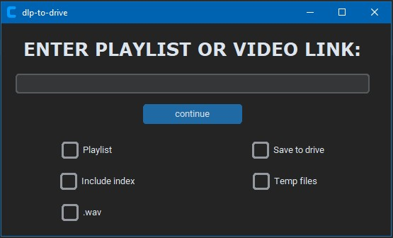

# dlp-to-drive

- A basic GUI for yt-dlp with Google Authentication implementation using PyDrive
  - Upload files and playlist to Google Drive automatically
  - Automatically delete files after uploaded to Google Drive
  - Store credentials locally to instantly upload to Google Drive



- **Playlist**: if checked, will download the entire playlist.
- **Include index**: if checked, the index in the playlist will be included in the filename.
- **Save to Drive**: if checked, files will be uploaded to linked Google Drive account.
- **Temp files**: if checked, local audio files are deleted after they are uploaded to Google Drive.
- **.wav**: Coverts the file to .wav, otherwise it will remain in original format (e.g. opus).

## How to use

- Install requirements. You will need to have [ffmpeg](https://ffmpeg.org/) and [yt-dlp](https://github.com/yt-dlp/yt-dlp?tab=readme-ov-file) installed and added to PATH or in the same directory as main.py.

```
$ pip install -r requirements.txt
```

- Run using

```
$ python main.py
```

to use Google Drive functionality, you will need to generate a client_secret and client_id and add those to the settings.yaml file. For more information, check the [documentation](https://developers.google.com/people/quickstart/python#set_up_your_environment).

## Future scope

- select directory to save files locally
- select output file format
- allow user to queue multiple links
- conduct further testing
